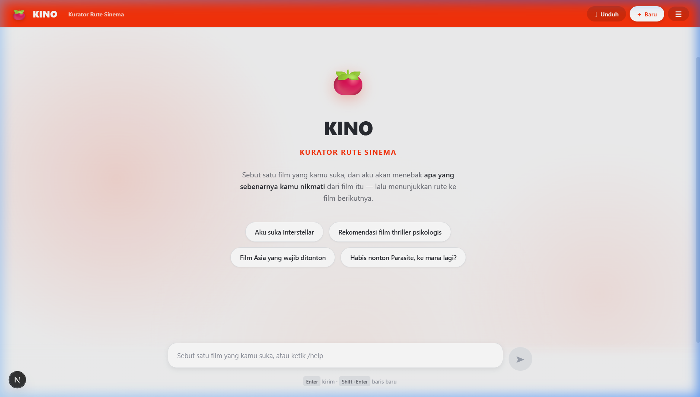
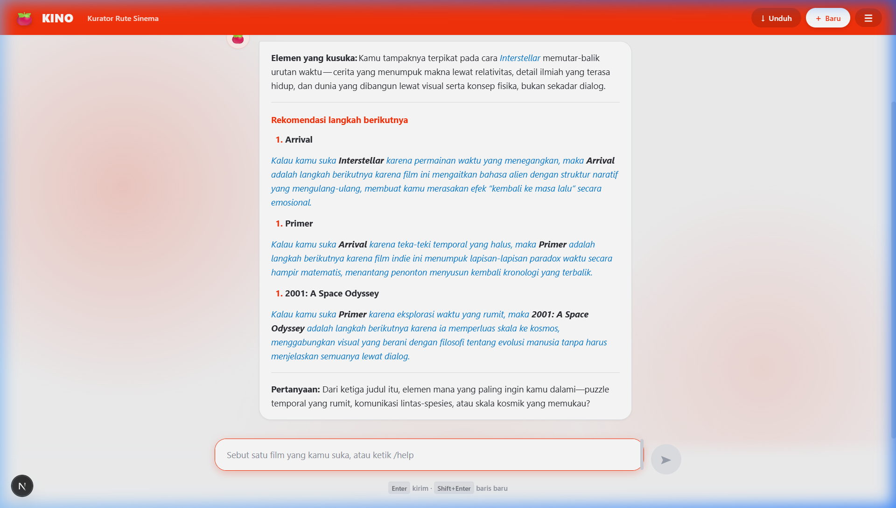
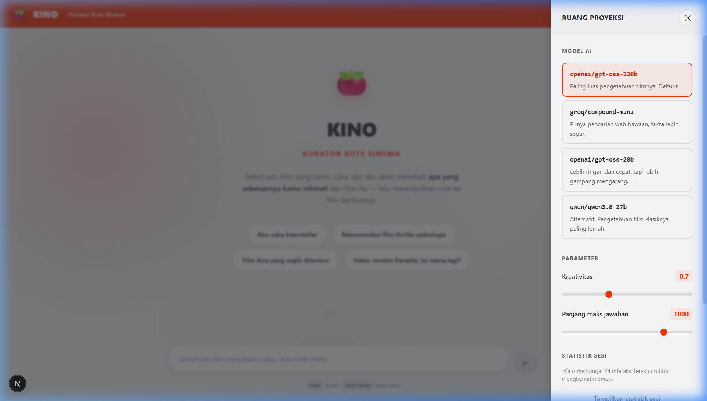

# KINO — Kurator Rute Sinema
### Asisten Rekomendasi Film Berbasis Large Language Model (LLM) dengan Kurasi Rute Bertahap

[](https://www.python.org/)
[](https://nextjs.org/)
[](https://fastapi.tiangolo.com/)
[](https://groq.com/)

KINO adalah asisten AI interaktif berbasis **Llama 3** (via Groq API) yang tidak sekadar merekomendasikan film, tetapi menunjukkan **rute** perjalanan sinematik dari film yang sudah ditonton menuju judul yang lebih menantang. 

---

## Daftar Isi
1. [Konsep & Pendekatan Asisten](#konsep--pendekatan-asisten)
2. [Spesifikasi Sistem & Fitur Pokok](#spesifikasi-sistem--fitur-pokok)
3. [Desain Antarmuka (UI/UX)](#desain-antarmuka-uiux)
4. [Arsitektur & Alur Kerja Sistem](#arsitektur--alur-kerja-sistem)
5. [Struktur Repositori](#struktur-repositori)
6. [Panduan Menjalankan Program (Step-by-Step)](#panduan-menjalankan-program-step-by-step)
   - [A. Eksperimen di Notebook (Jupyter / Colab)](#a-eksperimen-di-notebook-jupyter--colab)
   - [B. Menjalankan Web UI Interaktif Lokal (Fullstack)](#b-menjalankan-web-ui-interaktif-lokal-fullstack)
7. [Contoh Cuplikan Percakapan](#contoh-cuplikan-percakapan)
8. [Pemetaan ke Ketentuan Tugas](#pemetaan-ke-ketentuan-tugas)
9. [Catatan Pengembangan (Human vs AI)](#catatan-pengembangan-human-vs-ai)

---

## Konsep & Pendekatan Asisten

Kebanyakan chatbot rekomendasi film berhenti pada kalimat: *"ini daftar film bagus, silakan pilih"*. Masalahnya, itu bukan apa yang sesungguhnya dibutuhkan pencinta film. 

**KINO** memposisikan dirinya sebagai kurator rute dengan prosedur:
* **Analisis Elemen (Bukan Genre)**: Membaca apa yang sebenarnya dinikmati pengguna. Bukan sekadar genre "sci-fi", tapi "tokoh yang ambigu", "urutan waktu yang dibolak-balik", atau "kamera yang berani diam lama".
* **Jembatan Bertahap**: Merekomendasikan 1–3 judul yang menaikkan level elemen tersebut, disusun dari yang paling mudah dicerna hingga yang paling *niche*.
* **Penjelasan Sambungan**: Menjelaskan alasan dengan pola: *"Kalau kamu suka X karena Y, maka Z adalah langkah berikutnya karena ..."*
* **Aturan Fakta Ketat**: Untuk menghindari halusinasi khas LLM, KINO diinstruksikan untuk menghindari penyebutan tahun rilis jika tidak mutlak yakin, dibantu dengan potensi verifikasi eksternal.

---

## Spesifikasi Sistem & Fitur Pokok

| Komponen & Fitur Pokok | Spesifikasi & Implementasi Arsitektural |
| :--- | :--- |
| **Cloud LLM API** | Memanfaatkan **Groq API** dengan model utama **Llama 3 8B (8192)** untuk inferensi super cepat ber-latency rendah. |
| **Persona & Rekayasa System Prompt** | Menggunakan `_PERSONA` khusus yang dirancang untuk berdialog layaknya sinefil berwawasan luas namun tidak menggurui, dengan instruksi psikologis mendalam. |
| **State Management & History** | Mengelola memori percakapan dengan mekanisme pemangkasan pintar (`pangkas_riwayat`) untuk menghindari limitasi token tanpa kehilangan konteks. |
| **Resiliensi & Error Handling** | Penanganan eksepsi kokoh terhadap `RateLimitError` (menampilkan hitung mundur), `APIConnectionError` (auto-retry berjenjang), dan perlindungan integritas pesan pengguna saat API gagal. |
| **Sistem Perintah Kontrol Khusus** | Menyediakan instruksi spesifik: `exit`, `reset` (mengosongkan memori), `/statistik`, `/rute`, `/model`, dan `/suhu`. |
| **Dukungan Multi-Environment** | 1. **Interactive Jupyter Notebook**: Eksperimen cepat di Google Colab. <br>2. **Fullstack Modern Web Application**: Antarmuka visual penuh ala *Rotten Tomatoes* (Next.js + FastAPI). |
| **Pipeline Real-Time Streaming** | Menyajikan tanggapan secara bertahap (kata demi kata) dengan Python generator dan protokol *Server-Sent Events* (SSE). |
| **Ekstraksi Topik Otomatis** | Menggunakan pemanggilan API sekunder secara asinkron untuk mengekstrak daftar film yang pernah dibahas ke dalam format JSON demi fitur statistik. |

---

## Desain Antarmuka (UI/UX)

Antarmuka Web KINO dirancang untuk memberikan pengalaman selayaknya situs kurasi film premium.

<div align="center">
  
  <br/>
  <em>Tampilan Awal KINO</em>
  <br/><br/>
  
  <br/>
  <em>Antarmuka Percakapan dan Kurasi Rute</em>
  <br/><br/>
  
  <br/>
  <em>Sidebar Statistik dan Pengaturan LLM</em>
</div>

* **Filosofi Estetika & Palet Warna**: Terinspirasi dari estetika **Rotten Tomatoes** dengan tema terang (Light Mode). Menggunakan aksen merah (`#FA320A`) dan latar belakang putih bersih (`#FFFFFF` & `#F5F5F5`).
* **Stack Teknologi**: 
  - Dibangun murni dengan **Next.js (App Router)** dan *Vanilla CSS3*.
  - Efek *glassmorphism* dan animasi gelembung chat yang merespons secara halus.
  - **Dynamic Ambient Mist**: Efek visual *nadi (pulse)* bergradasi merah di latar belakang yang berdenyut lambat (*GPU-accelerated*) untuk menambah kesan dramatis tanpa memberatkan kinerja komputasi.
* **Interaktivitas Modern**: 
  - **SSE Streaming Reader**: Respons instan tanpa lag.
  - Sidebar fungsional yang menampung pengaturan Sesi (Model, Suhu, Limit Token) serta panel Ekspor/Impor riwayat (JSON).

---

## Arsitektur & Alur Kerja Sistem

```text
       [ Pengguna (Browser / Notebook) ]
             | (Pesan Alami, Perintah Khusus)
             v
     [ Next.js UI / Jupyter Interface ]
             |
             v
        [ FastAPI Backend (api.py) ]
             | (Routing & SSE Streaming)
             v
     [ KINO Chatbot Core (core.py) ]
             |
             +--> [ Pengelola Riwayat & System Prompt ]
             |
             v
   [ Groq Llama-3 API (Cloud LLM) ]
             | (Analisis Konteks, Kurasi Film)
             v
  [ Streaming Respon Kata demi Kata ]
             |
             v
       [ Pengguna ]
```

---

## Struktur Repositori

```text
Kino/
├── core.py               ← Logika utama: persona, memori, error handling, statistik
├── api.py                ← Backend FastAPI untuk melayani request web
├── kino_chatbot.ipynb    ← Antarmuka Jupyter Notebook / Google Colab (Pengganti CLI)
├── web/                  ← Folder aplikasi Frontend berbasis Next.js
│   ├── src/app/          ← Halaman UI dan styling (globals.css)
│   └── src/components/   ← Komponen UI (ChatInput, Sidebar, ChatMessage)
├── requirements.txt      ← Dependensi Python (Groq, FastAPI, dll)
├── .env                  ← API key (TIDAK ikut ter-push, disembunyikan lewat gitignore)
├── .gitignore            ← Aturan blokir file rahasia/sampah
└── Riwayat/              ← Direktori penyimpanan ekspor percakapan lokal
```

---

## Panduan Menjalankan Program (Step-by-Step)

### A. Eksperimen di Notebook (Jupyter / Colab)
Cara tercepat untuk menguji KINO, ideal untuk penilaian instan.
1. Buka file `kino_chatbot.ipynb` menggunakan Jupyter Notebook lokal atau unggah ke **Google Colab**.
2. *Run* sel pertama untuk menginstal pustaka yang dibutuhkan.
3. *Run* sel kedua dan masukkan **Groq API Key** ketika diminta (Dapatkan secara gratis di [console.groq.com](https://console.groq.com/keys)).
4. *Run* sel ketiga untuk memulai interaksi obrolan secara langsung di dalam Notebook!

### B. Menjalankan Web UI Interaktif Lokal (Fullstack)
Bagi yang menginginkan pengalaman interaktif penuh dengan antarmuka grafis estetis.
1. **Siapkan API Key**:
   Buat file `.env` baru di dalam folder utama proyek ini, lalu isi kodenya:
   ```env
   GROQ_API_KEY=gsk_xxxxxxxxxxxxxxxxxxxxxxxx
   ```
2. **Jalankan Backend (Python)**:
   ```bash
   pip install -r requirements.txt
   python -m uvicorn api:app --reload --port 8000
   ```
3. **Jalankan Frontend (Next.js)** (Buka terminal tab baru):
   ```bash
   cd web
   npm install
   npm run dev
   ```
4. Buka peramban (browser) dan akses alamat `http://localhost:3000`.

---

## Contoh Cuplikan Percakapan

**Kamu >** aku suka Interstellar

**Kino >** 
Kamu tampaknya terpikat pada eksplorasi ruang-waktu yang megah — bagaimana film menata skala kosmos sekaligus memutar waktu.

* Kalau kamu suka *Interstellar* karena elemen itu, maka *Gravity* adalah langkah berikutnya karena ia menyorot isolasi di luar angkasa lewat satu-shot panjang yang menegangkan.
* Selanjutnya, *Arrival* mengangkat konsep waktu non-linier lewat bahasa alien, menantang cara kita memaknai masa depan.
* Untuk tantangan paling tinggi, *2001: A Space Odyssey* menelusuri evolusi manusia lewat gambar tanpa dialog.

Sobat Sinema, elemen mana yang paling membuatmu terpesona — visual luar angkasa atau cara cerita memutar waktu?

---

## Pemetaan ke Ketentuan Tugas

| Ketentuan | Di mana / Keterangan |
| :--- | :--- |
| **Berjalan di console/terminal/notebook** | `kino_chatbot.ipynb` (Telah dimodernisasi dari bentuk CLI murni) |
| **Menggunakan API LLM** | Memanggil model Groq Llama 3 via `core.buat_klien()` |
| **Punya system prompt sesuai tema** | Diatur kokoh dalam variabel konstan `core._PERSONA` |
| **Mengelola conversation history** | Fungsi `riwayat_baru()` dan perlindungan token via `pangkas_riwayat()` |
| **Penanganan error (tidak crash)** | Translasi error API berlapis di `analisis_error()` |
| **Minimal 2 perintah khusus** | 9 perintah: `exit`, `reset`, `/statistik`, `/rute`, `/model`, `/suhu`, dll |
| ***Bonus* — Tampilan web** | *Fullstack* dengan FastAPI (`api.py`) & Next.js UI (`web/`) |
| ***Bonus* — Streaming response** | Diimplementasikan lewat generator `_stream_sekali()` & API SSE |
| ***Bonus* — Simpan & muat riwayat** | Fitur Impor/Ekspor JSON melalui Sidebar panel Web |
| ***Bonus* — Statistik percakapan** | Dihitung otomatis di antarmuka Web dan via command `/statistik` |
| ***Bonus* — Parameter kontrol** | *Slider* pengaturan `Suhu` & `Maksimal Token` di Sidebar Web UI |

---

## Catatan Pengembangan (Human vs AI)

Sesuai ketentuan, berikut adalah rincian peran dalam pengerjaan proyek ini:

**Dikerjakan Mandiri (Human):**
* **Konseptualisasi & Desain Produk**: Mengembangkan tema "Kurator Rute" alih-alih chatbot rekomendasi standar, karena menyadari bahwa preferensi film itu bersifat hierarkis dan bukan melulu berdasarkan genre makro.
* **Quality Assurance & Analisis Arsitektur**: Menemukan masalah pada versi awal (hilangnya ingatan saat *refresh browser*), serta merancang transisi dari aplikasi *streamlit* sederhana menjadi *Fullstack App* dengan manajemen *state* terpusat.
* **Penentuan Desain UI/UX**: Memberikan keputusan desain warna *Rotten Tomatoes* dan implementasi efek animasi *ambient mist* di latar belakang.

**Dibantu AI Assistant (LLM Coding Assistant):**
* **Penulisan Sintaks Kode Web**: Pembuatan komponen Vanilla CSS, struktur Next.js App Router, dan implementasi *Server-Sent Events* (SSE) di frontend.
* **Manajemen Logika API**: Menyusun taksonomi `try-except` berlapis di Python untuk manajemen *Rate Limit* serta pengolahan asinkron di FastAPI.
* **Penyusunan Dokumentasi**: Menyusun draf *README* terstruktur (file ini) untuk keperluan pengumpulan yang rapi dan profesional.
